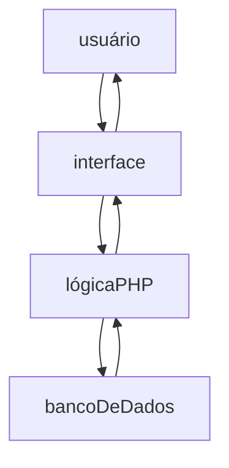

# Documentação de Especificações de Requisitos de Software (SRS)

## Sistema de criação de fichas de RPG - Áster

**Padrão Internacional:** ISO/IEC/IEEE 29148:2018 \
**Versão:** 1.0.0 \
**Data:** 12/06/2026 \
**Autor:** Thayssa Maneo

---

## Introdução

### 1.1 Propósito

Este documento visa descrever os requisitos do sistema **Áster - Criador de fichas**, com o objetivo de:

1. Definir funcionalidade;
2. Padronizar entendimentos entre os stakeholders;
3. Servir como base para desenvolvimento e teste;

---

### 1.2 Escopo

O sistema permitirá:

- Realização de login/cadastro para acessar as fichas feitas;
- Criar uma nova ficha;
- Excluir uma ficha;
- Exibir uma ficha
- Editar uma ficha

O sistema será uma aplicação web back-end e front-end utilizando:

- HTML
- CSS
- PHP
- Banco de dados PostGreSQL

Objetivos:

Construir uma aplicação web para criar fichas de RPG, usando como base o sistema Áster, de maneira interativa e simples.

---

### 1.3 Definições e Acrônimos

Tabela de termos e definições

| Termos | Definições |
| - | - |
| Ficha | Conjunto de informações sobre o personagem |
| Sistema Áster | O conjunto padrão de regras de RPG |

Lista de Acrônimos

- **RF:** Requisitos Funcionais;
- **RNF:** Requisitos Não Funcionais;
- **UC:** Casos de Uso;
- **CA:** Critérios de Aceitação;

---

### 1.4 Visão geral do documento

Este documento está organizado em:

- Introdução e visão geral;
- Descrição do sistema;
- Requisitos detalhados;
- Modelos UML;
- Regras de negócio;

---

## Descrição Geral do Documento

### 2.1 Perspectiva do sistema

---

### 2.2 Funções do sistema

O sistema deverá

- Cadastrar usuários;
- Cadastrar fichas;
- Realizar login;
- Atualizar fichas;
- Deletar fichas;

---

### 2.3 Ambientes operacionais

- Navegadores Web (Chrome, Edge, Firefox, Brave);

---

### 2.4 Restições

- Dependência de sessão: o usuário precisa ter realizado cadastro e login para acesso das páginas

---

### 2.5 Suposições

- O usuário possui conhecimento básico sobre o sistema de RPG Áster;
- O usuário possui conhecimentos básicos de informática;

---

## 3. Estrutura do banco de dados

O banco de dados foi modelado visando dividir a criação das fichas em tabelas especializadas ligadas por foreign Key

-- 1. Informações descritivas do personagem
CREATE TABLE informacoesBase (
    idInformacoesBase SERIAL PRIMARY KEY,
    nomePersonagem TEXT,
    idade INT,
    especie TEXT,
    aparencia TEXT,
    conexaoMagica INT,
    hobbies TEXT,
    inventario TEXT,
    observacoes TEXT,
    magiasConhecidas TEXT
);

-- 2. Atributos
CREATE TABLE atributos (
    idAtributos SERIAL PRIMARY KEY,
    forca INT,
    intelecto INT,
    agilidade INT,
    carisma INT,
    vida INT,
    afinidadeMagica INT,
    defesa INT,
    defesaMagica INT,
    bloqueio INT
);

-- 3. Lista de perícias
CREATE TABLE habilidades (
    idHabilidades SERIAL PRIMARY KEY,
    crime INT,
    furtividade INT,
    iniciativa INT,
    tiroAoAlvo INT,
    luta INT,
    atletismo INT,
    intuicao INT,
    investigacao INT,
    medicina INT,
    sobrevivencia INT,
    tatica INT,
    labia INT,
    orientacaoGeografica INT,
    percepcao INT,
    adestramento INT,
    alquimia INT,
    navegacao INT
);

-- 4. Tabela central
CREATE TABLE fichas (
    idFichas SERIAL PRIMARY KEY,
    informacoesBase_id INT,
    atributos_id INT,
    habilidades_id INT,
    criadaEm DATE,
    usuario_id INT,
    CONSTRAINT fk_informacoesBase FOREIGN KEY (informacoesBase_id) REFERENCES informacoesBase (idInformacoesBase),
    CONSTRAINT fk_atributos FOREIGN KEY (atributos_id) REFERENCES atributos (idAtributos),
    CONSTRAINT fk_habilidades FOREIGN KEY (habilidades_id) REFERENCES habilidades (idHabilidades)
);

-- 5. Registro de credenciais de acesso de usuários autenticados
CREATE TABLE usuarios (
    idUsuarios SERIAL PRIMARY KEY,
    nomeUsuario TEXT UNIQUE,
    senha TEXT
);

ALTER TABLE fichas ADD CONSTRAINT fk_usuario FOREIGN KEY (usuario_id) REFERENCES usuarios(idUsuarios);

## 4. Requisitos do Sistema

### 4.1 Requisitos Funcionais (RF)

Os requisitos funcionais descrevem as interações que a aplicação web deve permitir aos usuárioes e o comportamento esperado do backend em cada cenário de caso de uso.

| Identificador | Título do Requisito | Descrição |
| :--- | :--- | :--- |
| **RF-01** | **Autenticação de usuárioes** | O sistema deve permitir que novos usuários criem uma conta fornecendo um nome de usuário único e uma senha, além de autenticarem-se no sistema posteriormente. |
| **RF-02** | **Proteção de Rotas (Sessão)** | O sistema deve impedir o acesso direto às páginas de gestão de fichas (`suasFichas.php`, `criarFicha.php`, `editarFicha.php`) caso o usuário não possua uma sessão ativa no navegador. |
| **RF-03** | **Criação de Fichas de Personagem** | O usuário autenticado deve conseguir preencher um formulário para registar uma nova ficha de RPG contendo Informações Base, Atributos Numéricos e Habilidades. |
| **RF-04** | **Upload de Imagem de Avatar** | O formulário de criação e edição deve permitir o envio de um ficheiro de imagem (`.png`, `.jpg`, `.jpeg`) para ilustrar a aparência do personagem, gerando um nome único no servidor. |
| **RF-05** | **Listagem Dinâmica (Painel)** | O sistema deve apresentar na página principal (`suasFichas.php`) todas as fichas pertencentes exclusivamente ao usuário logado, ordenadas da mais recente para a mais antiga. |
| **RF-06** | **Edição de Fichas Existentes** | O usuário deve conseguir alterar qualquer campo de texto ou numérico de uma ficha criada anteriormente, atualizando os dados nas sub-tabelas correspondentes no PostgreSQL. |
| **RF-07** | **Exclusão Segura** | O sistema deve disponibilizar a opção de eliminar uma ficha. A ação deve apagar o registo principal e todos os dados associados nas tabelas de atributos, habilidades e informações base de forma transacional. |
| **RF-08** | **Isolamento de Dados (Privacidade)** | Um usuário autenticado jamais deve conseguir visualizar, editar ou eliminar fichas criadas por outros usuários, validando sempre a propriedade do registo no banco de dados. |

---

### 4.2 Requisitos Não Funcionais (RNF)

| Identificador | Categoria | Descrição Detalhada / Critério de Aceitação |
| :--- | :--- | :--- |
| **RNF-01** | **Segurança** | Todas as senhas devem ser armazenadas no banco de dados |
| **RNF-02** | **Segurança** | O sistema deve mitigar ataques aplicando a função `htmlspecialchars()` em todos os dados textuais antes de os renderizar no HTML. |
| **RNF-03** | **Interface e Usabilidade** | O design visual da aplicação deve respeitar a identidade visual estabelecida e ser totalmente responsivo. |
| **RNF-04** | **Desempenho** | Para garantir o correto redirecionamento HTTP (`header("Location: ...")`) sem conflitos de envio de HTML, o sistema deve utilizar buffering de saída (`ob_start()`) no topo dos scripts. |

## 5. Executando o projeto

### 5.1 Clonando o repositório

1. copiar o link `<https://github.com/thayssamaneo/projetoAster.git>`\
2. utilizar o comando `"git clone https://github.com/thayssamaneo/projetoAster.git" no terminal`

### 5.2 Realizar restore do banco de dados

1. Utilize o comando `psql -U usuario -d fichasaster -f C:\usuario\dowloads\backup_fichas_aster.sql` no terminal

### 5.3 Inicializar o servidor php

1. Utilizar o comando `php -S localhost:5000` no terminal
